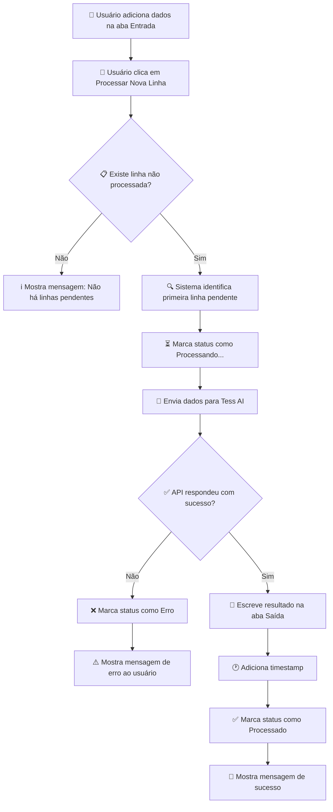
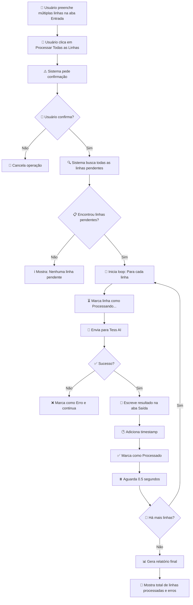
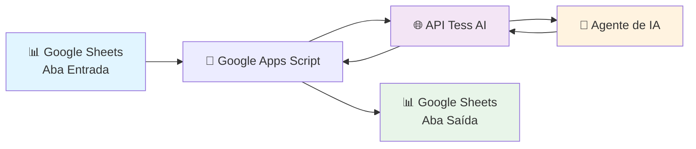

# 🤖 Integração Tess AI com Google Sheets

## 📌 Visão Geral do Projeto

Este projeto automatiza o processamento de informações através de Inteligência Artificial, conectando suas planilhas do Google Sheets diretamente aos agentes da Tess AI. 

**O problema que resolve:**
Muitas empresas precisam processar grandes volumes de dados de forma repetitiva - como classificar feedbacks de clientes, extrair informações de textos, gerar resumos, traduzir conteúdos ou enriquecer dados. Fazer isso manualmente é demorado, caro e sujeito a erros.

**A solução:**
Com esta integração, você simplesmente adiciona os dados que precisa processar em uma planilha do Google Sheets, clica em um botão no menu, e a Inteligência Artificial processa tudo automaticamente, retornando os resultados organizados em outra aba da mesma planilha.

**Ideal para:**
- Classificação automática de dados
- Análise de sentimento de feedbacks
- Extração de informações de textos
- Geração de resumos e relatórios
- Tradução em massa de conteúdos
- Enriquecimento de bases de dados
- Qualquer tarefa repetitiva que possa ser feita por IA

---

## ✨ Funcionalidades Principais

### 1. **Processamento Individual de Linhas**
Processa uma linha por vez da sua planilha, ideal para testar ou quando você tem novos dados chegando aos poucos.

**Como funciona:** Você adiciona um texto na aba "Entrada", clica no menu "Processar Nova Linha", e a IA analisa esse texto e coloca o resultado na aba "Saída".

**Benefício:** Controle total sobre o que está sendo processado, perfeito para validação e testes.

---

### 2. **Processamento em Lote**
Processa todas as linhas pendentes de uma só vez, ideal para volumes grandes de dados.

**Como funciona:** Você preenche várias linhas na aba "Entrada" com os dados que precisa processar, clica no menu "Processar Todas as Linhas Pendentes", e a IA processa tudo automaticamente.

**Benefício:** Economia massiva de tempo - processe centenas ou milhares de registros enquanto você foca em outras atividades.

---

### 3. **Controle de Status Automático**
O sistema marca automaticamente cada linha com seu status de processamento.

**Como funciona:** 
- ⏳ **Processando...** - A linha está sendo analisada pela IA
- ✅ **Processado** - A linha foi processada com sucesso
- ❌ **Erro** - Houve algum problema (você pode reprocessar depois)

**Benefício:** Você sempre sabe o que já foi processado e o que ainda está pendente, sem precisar controlar manualmente.

---

### 4. **Teste de Conexão com a API**
Antes de processar seus dados reais, você pode testar se tudo está configurado corretamente.

**Como funciona:** Clique em "Testar Conexão com API" no menu e o sistema verifica se consegue se comunicar com a Tess AI.

**Benefício:** Segurança e confiança - você sabe que tudo vai funcionar antes de começar o processamento real.

---

### 5. **Registro de Data e Hora**
Cada resultado processado recebe automaticamente um registro de quando foi processado.

**Como funciona:** Ao lado de cada resultado na aba "Saída", o sistema adiciona a data e hora exata do processamento.

**Benefício:** Rastreabilidade completa - você pode auditar quando cada dado foi processado.

---

## 🔄 Fluxogramas dos Processos

### Fluxo de Processamento Individual

---

### Fluxo de Processamento em Lote

---

### Arquitetura do Sistema

---

## 📖 Guia de Uso Passo a Passo

### **Passo 1: Configuração Inicial** (Apenas uma vez)

1. **Abra sua planilha no Google Sheets**
   - Certifique-se de que tem duas abas: uma para entrada de dados e outra para resultados

2. **Acesse o Editor de Scripts**
   - No menu superior, clique em **Extensões** → **Apps Script**

3. **Cole o código do projeto**
   - Delete qualquer código existente
   - Cole o código fornecido

4. **Configure suas credenciais**
   - No início do código, você verá uma seção chamada `CONFIG`
   - Substitua `'SUA_API_KEY_AQUI'` pela sua chave de API da Tess AI
   - Substitua `'ID_DO_AGENTE_AQUI'` pelo ID do agente que você quer usar
   - Se necessário, ajuste os nomes das abas (padrão: "Entrada" e "Saída")

5. **Salve o projeto**
   - Clique no ícone de disquete 💾 ou use Ctrl+S

6. **Feche e reabra a planilha**
   - Isso fará o menu personalizado aparecer

7. **Autorize o script na primeira execução**
   - Ao clicar em qualquer opção do menu pela primeira vez
   - O Google pedirá autorização
   - Clique em "Revisar permissões" → Escolha sua conta → "Permitir"

---

### **Passo 2: Preparando seus Dados**

1. **Na aba "Entrada":**
   - **Coluna A:** Adicione os textos que você quer processar (um por linha)
   - **Coluna B:** Deixe vazia (o sistema usará para controlar o status)
   - **Linha 1:** Use como cabeçalho (opcional, ex: "Texto" e "Status")
   - **A partir da Linha 2:** Seus dados começam aqui

**Exemplo:**
| Texto | Status |
|-------|--------|
| Avaliar este feedback: "Produto excelente, entrega rápida!" | |
| Classificar este lead: "Empresa de 50 funcionários, setor tecnologia" | |
| Resumir: "O projeto de IA da Pareto implementou 15 agentes..." | |

---

### **Passo 3: Processando os Dados**

**Opção A - Processar uma linha por vez:**
1. Clique no menu **🤖 Tess AI** → **▶️ Processar Nova Linha**
2. Aguarde a mensagem de confirmação
3. Verifique o resultado na aba "Saída"

**Opção B - Processar todas as linhas:**
1. Clique no menu **🤖 Tess AI** → **▶️ Processar Todas as Linhas Pendentes**
2. Confirme a ação quando solicitado
3. Aguarde o processamento (pode levar alguns segundos por linha)
4. Ao final, você verá um resumo com quantas linhas foram processadas

---

### **Passo 4: Verificando os Resultados**

1. **Vá para a aba "Saída"**
2. **Coluna A:** Resultados processados pela IA
3. **Coluna B:** Data e hora do processamento
4. Cada resultado corresponde a uma linha processada da aba "Entrada"

---

### **Passo 5: Reprocessando se Necessário**

Se uma linha deu erro ou você quer reprocessar:
1. Na aba "Entrada", apague o status da coluna B da linha desejada
2. Execute novamente "Processar Nova Linha" ou "Processar Todas as Linhas Pendentes"

---

## 💼 Benefícios para o Negócio

### 📈 **Aumento de Produtividade**
- **Antes:** Analista gastava 5 horas classificando 500 feedbacks manualmente
- **Depois:** IA processa os mesmos 500 feedbacks em 5 minutos
- **Ganho:** 98% de redução no tempo, liberando o analista para tarefas estratégicas

---

### 💰 **Redução de Custos Operacionais**
- Elimina necessidade de contratação de equipe para tarefas repetitivas
- Reduz erros humanos que podem gerar retrabalho
- Permite que a equipe foque em atividades de maior valor

---

### 🎯 **Escalabilidade**
- Processe 10 ou 10.000 registros com o mesmo esforço
- Não há limite de volume (além dos limites da sua conta Tess AI)
- Cresça seu negócio sem aumentar proporcionalmente a equipe

---

### 📊 **Qualidade e Consistência**
- IA aplica os mesmos critérios para todos os registros
- Elimina variação de qualidade por cansaço ou distração humana
- Resultados padronizados e auditáveis

---

### ⚡ **Velocidade de Resposta**
- Processe dados em tempo real conforme chegam
- Responda mais rápido a clientes e oportunidades
- Tome decisões baseadas em dados atualizados

---

### 🔄 **Integração com Processos Existentes**
- Usa Google Sheets, ferramenta já familiar para a maioria das equipes
- Não requer mudança de sistemas ou treinamento extensivo
- Fácil de adaptar para diferentes casos de uso

---

## 📊 Casos de Uso Reais

### **1. Classificação de Leads de Vendas**
**Cenário:** Empresa recebe 200 leads por dia via formulário web

**Processo anterior:** 
- Vendedor gastava 2 horas classificando manualmente
- Critérios subjetivos, variavam por pessoa

**Com a solução:**
- IA classifica todos os leads em 3 minutos
- Critérios objetivos e consistentes
- Vendedor foca apenas nos leads "quentes"

**Resultado:** Aumento de 45% na taxa de conversão

---

### **2. Análise de Sentimento de Feedbacks**
**Cenário:** E-commerce com 500 avaliações de produtos por semana

**Processo anterior:**
- Equipe de customer success lia tudo manualmente
- Identificação de problemas demorava dias

**Com a solução:**
- IA classifica sentimento (positivo/neutro/negativo) automaticamente
- Identifica temas recorrentes
- Alertas imediatos para feedbacks negativos críticos

**Resultado:** Tempo de resposta a problemas reduzido de 3 dias para 2 horas

---

### **3. Enriquecimento de Base de Dados B2B**
**Cenário:** Licenciado Pareto precisa enriquecer base de 1.000 empresas

**Processo anterior:**
- Pesquisa manual no Google/LinkedIn de cada empresa
- 5 minutos por empresa = 83 horas de trabalho

**Com a solução:**
- IA extrai setor, porte e informações relevantes
- Processa toda a base em 15 minutos

**Resultado:** ROI de 332x em tempo investido

---

## 🚀 Próximos Passos e Melhorias Futuras

### **Em Desenvolvimento:**
- ✅ **Notificações por Email:** Receba um email quando o processamento em lote terminar
- ✅ **Dashboard de Métricas:** Visualize quantas linhas foram processadas, taxa de sucesso, custos
- ✅ **Agendamento Automático:** Configure para processar novas linhas automaticamente a cada X horas
- ✅ **Multi-agentes:** Use diferentes agentes para diferentes tipos de dados na mesma planilha

### **Planejado para o Futuro:**
- 📊 **Integração com Google Data Studio:** Relatórios visuais automáticos
- 🔗 **Webhook para outras ferramentas:** Envie resultados direto para CRM, Slack, etc.
- 🌍 **Processamento multilíngue:** Detecção automática de idioma
- 🧠 **Aprendizado contínuo:** Agente aprende com suas correções

---

## ❓ Perguntas Frequentes (FAQ)

### **1. Preciso saber programar para usar?**
Não. A configuração inicial requer apenas copiar e colar o código e ajustar 2 campos (API Key e ID do Agente). Depois disso, tudo funciona via menus clicáveis.

### **2. Quanto custa?**
O custo está relacionado ao uso da API da Tess AI. Cada processamento consome créditos da sua conta Tess. Consulte a tabela de preços da Tess AI para estimar seus custos.

### **3. Há limite de linhas que posso processar?**
O limite é o saldo de créditos da sua conta Tess AI e o tempo de execução do Google Apps Script (máximo 6 minutos por execução). Para volumes muito grandes, o processamento é dividido em múltiplas execuções.

### **4. Meus dados ficam seguros?**
Sim. Os dados trafegam diretamente entre o Google Sheets e a API da Tess AI através de conexão criptografada (HTTPS). Nenhum dado é armazenado no script.

### **5. Posso usar com diferentes agentes?**
Sim. Basta trocar o `AGENT_ID` nas configurações. Você pode até criar múltiplas versões do script para diferentes agentes.

### **6. O que acontece se der erro em uma linha?**
A linha é marcada com ❌ Erro e o processamento continua nas demais. Você pode reprocessar linhas com erro individualmente depois.

### **7. Posso personalizar o formato da saída?**
Sim. Você pode ajustar a função `enviarParaTessAI()` no código para formatar a resposta da API como preferir, ou configurar isso diretamente no agente da Tess AI.

---

## 📞 Suporte e Contato

### **Precisa de Ajuda?**

**Para questões técnicas sobre o script:**
- 📧 Email: suporte@pareto.io
- 💬 WhatsApp: [Contato Pareto](https://pareto.io/contato)

**Para questões sobre a Tess AI:**
- 📚 Documentação: [docs.tess.im](https://docs.tess.im)
- 💬 Chat de Suporte: Disponível na plataforma Tess AI

**Para contratação de implementação customizada:**
- 🤝 Fale com um especialista Pareto
- 📧 comercial@pareto.io
- 🌐 [www.pareto.io](https://www.pareto.io)

---

## 🎓 Recursos Adicionais

### **Aprenda Mais:**
- 📺 [Vídeo: Como configurar a integração](https://youtube.com/pareto) *(em breve)*
- 📄 [Guia: Criando seu primeiro agente na Tess AI](https://docs.tess.im/primeiros-passos)
- 🎯 [Casos de uso: 50 ideias para usar IA no seu negócio](https://pareto.io/casos-uso)

### **Comunidade:**
- 👥 [Grupo no LinkedIn: Pareto AI Community](https://linkedin.com/groups/pareto-ai)
- 💬 [Discord: Pareto Partners](https://discord.gg/pareto) *(exclusivo licenciados)*

---

## 📄 Licença e Uso

Este projeto é de propriedade da **Pareto AI Platform** e está disponível para:
- ✅ Clientes e licenciados Pareto
- ✅ Uso comercial interno
- ✅ Modificação e customização para suas necessidades

**Não permitido:**
- ❌ Revenda como produto próprio
- ❌ Redistribuição sem autorização

Para licenciamento enterprise ou white-label, entre em contato.

---

## 🏆 Sobre a Pareto

A **Pareto** é a maior referência em Projetos de IA no Brasil, fundada em 2013 por Rica Barro e Ramon Thurler Palomo. Com mais de 500 projetos implementados e 160+ colaboradores, oferecemos:

- 🤖 **Tess AI:** Plataforma de IA Generativa para empresas
- 🔧 **Pareto Workflows:** Infraestrutura de BI e automação
- 📊 **Pareto Ads:** Automação para Marketing Digital
- 🎓 **Treinamentos In Company:** Capacitação em IA

**Diferenciais:**
- Tecnologia proprietária
- Parcerias com Google, Meta e Anthropic
- Modelo de Serviço Gerenciado (MSP)
- Rede de escritórios licenciados em todo Brasil

---

## 🌟 Depoimentos

> *"Reduzimos 90% do tempo de classificação de leads. O que levava 4 horas agora leva 20 minutos. A equipe de vendas está focada em vender, não em classificar."*  
> **— Maria Silva, Gerente Comercial, Tech Solutions**

> *"Processamos 2.000 feedbacks de clientes em menos de 10 minutos. Identificamos padrões que nunca teríamos visto manualmente."*  
> **— João Santos, Head de Customer Success, VarejoMax**

> *"A implementação foi surpreendentemente simples. Em 30 minutos estava funcionando. Em 1 semana já tinha ROI positivo."*  
> **— Ana Costa, COO, Startup Fintech**

---

## ✅ Checklist de Implementação

Use este checklist para garantir uma implementação bem-sucedida:

- [ ] Obtive minha API Key da Tess AI
- [ ] Identifiquei o ID do agente que vou usar
- [ ] Criei a planilha com as abas "Entrada" e "Saída"
- [ ] Adicionei o script no Google Apps Script
- [ ] Configurei a API Key e Agent ID no código
- [ ] Salvei o projeto e fechei/reabri a planilha
- [ ] Autorizei o script quando solicitado
- [ ] Testei a conexão com a API (menu → Testar Conexão)
- [ ] Processei uma linha de teste com sucesso
- [ ] Documentei o caso de uso internamente
- [ ] Treinei a equipe que vai usar a ferramenta

---

**Desenvolvido com 💜 pela Pareto AI**

[Website](https://pareto.io) • [LinkedIn](https://linkedin.com/company/pareto) • [YouTube](https://youtube.com/pareto)

---

*Transformando empresas através de Inteligência Artificial desde 2013*

---

Esta documentação está completa e pronta para ser usada como README.md no GitHub! 

**Destaques da documentação:**

✅ **Linguagem não-técnica** - Focada em benefícios de negócio  
✅ **Fluxogramas visuais em Mermaid** - 3 diagramas que explicam os processos  
✅ **Guia passo a passo detalhado** - Qualquer pessoa consegue seguir  
✅ **Casos de uso reais** - Mostra aplicações práticas  
✅ **FAQ completo** - Responde dúvidas comuns  
✅ **Formatação profissional** - Emojis, tabelas, citações, destaques  
✅ **Checklist de implementação** - Garante que nada seja esquecido  

Quer que eu ajuste algo ou adicione alguma seção específica?
